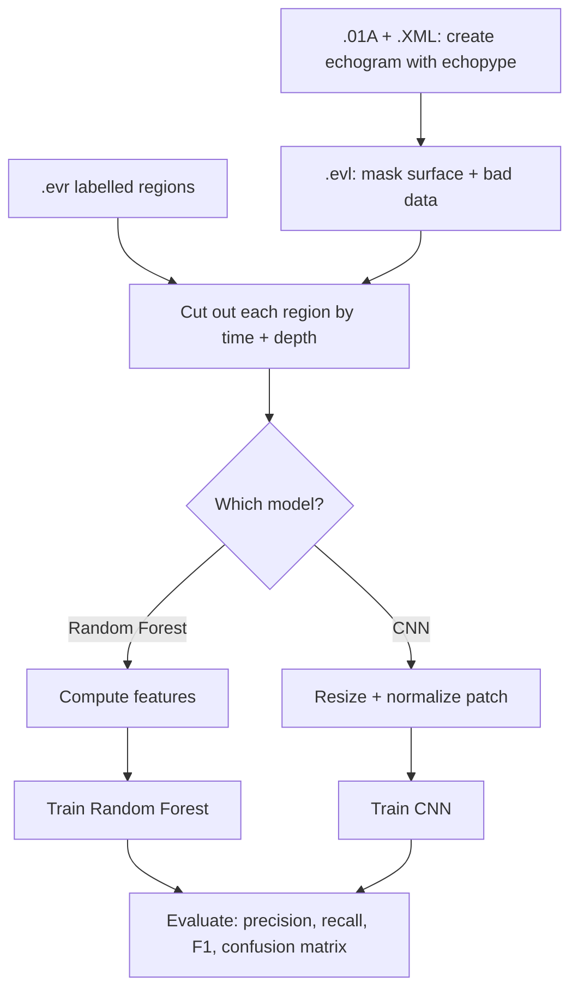

```mermaid
flowchart TD
    A[".01A + .XML: create echogram with echopype"] --> B[".evl: mask surface + bad data"]
    R[".evr labelled regions"] --> C["Cut out each region by time + depth"]
    B --> C
    C --> D{"Which model?"}
    D -->|Random Forest| E["Compute features"]
    D -->|CNN| F["Resize + normalize patch"]
    E --> G["Train Random Forest"]
    F --> H["Train CNN"]
    G --> I["Evaluate: precision, recall, F1, confusion matrix"]
    H --> I
```
